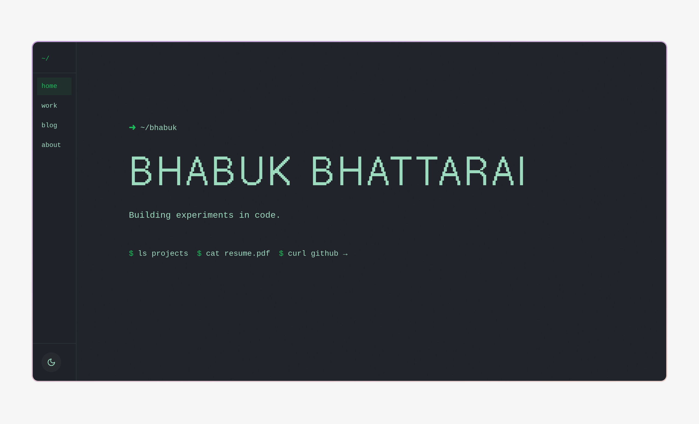

# Bhabuk Bhattarai — Portfolio

A personal portfolio site with a terminal/CLI-inspired aesthetic — built with Next.js, TypeScript, and Tailwind CSS. It features a glitching pixel-font hero, a typing animation, scroll-revealed sections, and a blog rendered from markdown with syntax highlighting.

**[Live site](https://bhabukb.com.np)**



## Features

- **Terminal aesthetic** — CLI-style prompt, typing effect, glitch animation, pixel noise overlay, and a custom cursor
- **Blog** — markdown posts with syntax highlighting, tags, and related-post suggestions
- **Theme toggle** — light/dark mode via CSS custom properties
- **SEO** — OpenGraph/Twitter cards, JSON-LD structured data, `sitemap.xml` and `robots.txt` (robots are noindexed on preview deployments)
- **Analytics** — Vercel Analytics
- **Responsive** — fixed sidebar navigation on desktop, slide-in mobile menu on smaller screens

## Tech Stack

- **Framework**: Next.js 14 (App Router)
- **Language**: TypeScript (strict mode)
- **Styling**: Tailwind CSS v4, class-variance-authority, tailwind-merge
- **Animation**: Framer Motion
- **UI primitives**: Radix UI, Lucide icons
- **Markdown**: react-markdown, remark-gfm, rehype-highlight
- **Forms**: react-hook-form
- **Fonts**: Geist Pixel Square via `next/font/google`

## Getting Started

### Prerequisites

- Node.js 18.17+ (Next.js 14 requirement)
- npm

### Installation

```bash
npm install
```

### Development

```bash
npm run dev
```

Open [http://localhost:3000](http://localhost:3000) in your browser.

### Production

```bash
npm run build
npm run start
```

### Lint

```bash
npm run lint
```

## Project Structure

```
├── app/                    # App Router pages and route handlers
│   ├── blog/[id]/         # Dynamic blog post pages
│   ├── json-ld.tsx        # JSON-LD structured data
│   ├── layout.tsx         # Root layout, metadata, fonts
│   ├── page.tsx           # Home page (single-page sections)
│   ├── robots.ts          # Robots config
│   └── sitemap.ts         # Sitemap generation
├── components/            # React components
│   ├── ui/                # Reusable UI primitives
│   └── *.tsx              # Feature sections (hero, work, blog, about, contact)
├── hooks/                 # Custom React hooks
├── lib/
│   ├── blog-posts/        # Blog post content as TypeScript modules
│   └── utils.ts           # cn() helper
├── content/               # Legacy content directory
└── public/                # Static assets (images, resume, audio)
```

## Adding a Blog Post

Blog posts live in `lib/blog-posts/` as TypeScript modules.

1. Create a new file, e.g. `lib/blog-posts/my-post.ts`:

```typescript
export const myPost = {
  id: "my-post",
  title: "My Post Title",
  excerpt: "A brief description of your post",
  date: "2025-01-01",
  category: "Technology",
  readTime: 5,
  tags: ["tag1", "tag2"],
  content: `## Your markdown here

Write your post using markdown. Code blocks are syntax-highlighted.
`
}
```

2. Register it in `lib/blog-posts/index.ts`:

```typescript
import { myPost } from "./my-post"

export const allBlogPosts: BlogPost[] = [
  myPost,
  // ...other posts
]
```

The post will automatically appear on the home page and its `/blog/my-post` page, including OpenGraph metadata and related-post links.

## Deployment

Deploy to Vercel with the included `vercel-build` script. The site is Vercel-aware: search indexing is disabled automatically on preview deployments via the `VERCEL_ENV` environment variable.
